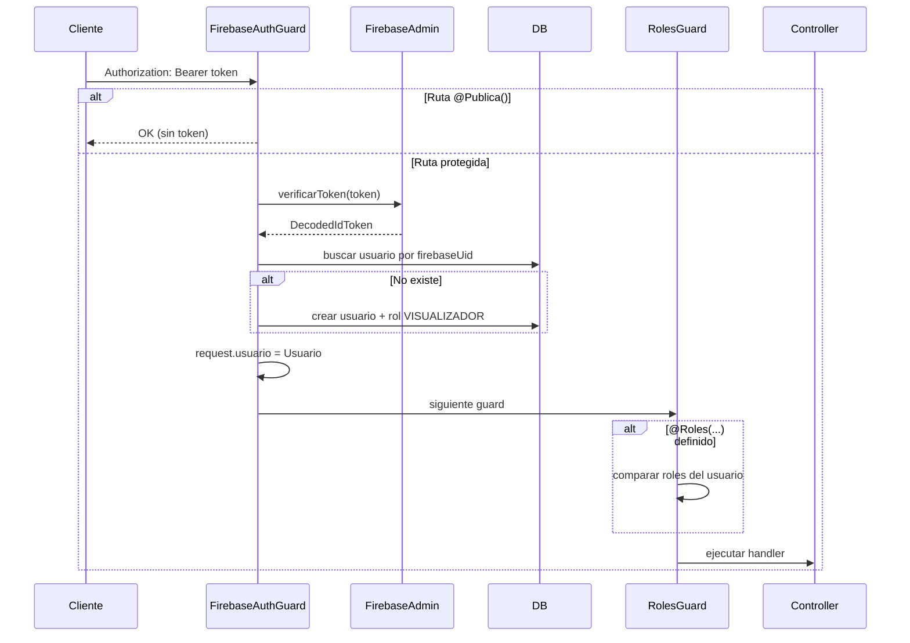

# Ruralia Backend — Documentación de sesión 02

> **Fecha:** 25 de junio de 2026  
> **Sesión:** Autenticación con Firebase Admin SDK  
> **Gestor de paquetes:** pnpm

---

## Resumen de la sesión

Se agregó autenticación basada en **Firebase Admin SDK** al backend NestJS existente:

1. Instalación de `firebase-admin` (paquete oficial; expone `firebase-admin/app` y `firebase-admin/auth`)
2. Módulo `autenticacion` con servicio, guards globales, decoradores y controlador
3. Guards globales registrados vía `APP_GUARD`
4. Actualización de `.env.example` con variables Firebase

---

## Dependencia instalada

```bash
pnpm add firebase-admin
```

> **Nota:** Los paquetes `@firebase-admin/app` y `@firebase-admin/auth` no existen en npm como paquetes separados. El SDK oficial es `firebase-admin`, que exporta esos submódulos:
>
> ```ts
> import { initializeApp, cert } from 'firebase-admin/app';
> import { getAuth, DecodedIdToken } from 'firebase-admin/auth';
> ```

---

## Variables de entorno

| Variable | Descripción |
|----------|-------------|
| `FIREBASE_PROJECT_ID` | ID del proyecto Firebase |
| `FIREBASE_CLIENT_EMAIL` | Email de la cuenta de servicio |
| `FIREBASE_PRIVATE_KEY` | Clave privada (con `\n` para saltos de línea) |

Ver `.env.example` para el formato completo junto con las variables de BD.

---

## Estructura del módulo `autenticacion`

```
src/autenticacion/
├── autenticacion.module.ts
├── autenticacion.controller.ts
├── autenticacion.service.ts
├── firebase-admin.service.ts
├── constants/metadata-keys.ts
├── enums/rol.enum.ts          # alias de NombreRol → RolEnum
├── decorators/
│   ├── publica.decorator.ts
│   ├── roles.decorator.ts
│   └── usuario-actual.decorator.ts
├── guards/
│   ├── firebase-auth.guard.ts
│   └── roles.guard.ts
└── types/express.d.ts         # extiende Request con usuario
```

---

## Flujo de autenticación



---

## Componentes

### FirebaseAdminService

- Inicializa Firebase Admin en `onModuleInit` con variables de entorno
- Convierte `\\n` → saltos de línea reales en la clave privada
- Expone `verificarToken(token)` → `DecodedIdToken`

### FirebaseAuthGuard (global)

1. Si la ruta tiene `@Publica()` → permite acceso
2. Lee `Authorization: Bearer <token>`
3. Verifica token con Firebase
4. Busca usuario en BD por `firebaseUid`; si no existe, lo crea con rol **VISUALIZADOR**
5. Adjunta `request.usuario`
6. Lanza `UnauthorizedException` si falta o es inválido el token

### RolesGuard (global)

- Si no hay `@Roles(...)` → permite acceso
- Compara roles requeridos contra `request.usuario.roles`
- Lanza `ForbiddenException` si no tiene permiso

### Decoradores

| Decorador | Uso |
|-----------|-----|
| `@Publica()` | Ruta sin autenticación |
| `@Roles(RolEnum.ADMINISTRADOR, ...)` | Restringe por rol |
| `@UsuarioActual()` | Extrae `request.usuario` en parámetros |

`RolEnum` es alias de `NombreRol` del módulo usuarios.

---

## Endpoints

| Método | Ruta | Auth | Descripción |
|--------|------|------|-------------|
| GET | `/` | No (`@Publica`) | Health/hello |
| GET | `/autenticacion/yo` | Sí | Retorna el usuario actual de la BD |

### Ejemplo: obtener usuario actual

```bash
curl -H "Authorization: Bearer <firebase-id-token>" \
  http://localhost:3000/autenticacion/yo
```

---

## Registro en AppModule

`AutenticacionModule` se importa en `AppModule`. Los guards globales se registran dentro de `AutenticacionModule`:

```ts
{ provide: APP_GUARD, useClass: FirebaseAuthGuard },
{ provide: APP_GUARD, useClass: RolesGuard },
```

**Orden de ejecución:** FirebaseAuthGuard → RolesGuard

---

## Conexión con módulo usuarios

| Componente | Relación |
|------------|----------|
| `AutenticacionModule` | importa `UsuariosModule` |
| `AutenticacionService` | usa repositorios `Usuario` y `Rol` |
| Auto-registro | Crea `Usuario` vinculado a `firebaseUid` del token |
| Rol por defecto | `VISUALIZADOR` (se crea el rol en BD si no existe) |

---

## Uso en controladores futuros

```ts
import { Roles } from './autenticacion/decorators/roles.decorator';
import { RolEnum } from './autenticacion/enums/rol.enum';
import { UsuarioActual } from './autenticacion/decorators/usuario-actual.decorator';
import { Publica } from './autenticacion/decorators/publica.decorator';

@Publica()
@Get('salud')
salud() { return { ok: true }; }

@Roles(RolEnum.ADMINISTRADOR)
@Get('admin')
soloAdmin(@UsuarioActual() usuario: Usuario) { ... }
```

---

## Historial de sesiones

| Sesión | Fecha | Contenido |
|--------|-------|-----------|
| 01 | 2026-06-25 | Estructura base: 10 módulos, 22 entidades, TypeORM + PostgreSQL |
| 02 | 2026-06-25 | Autenticación Firebase Admin SDK, guards globales, decoradores |
