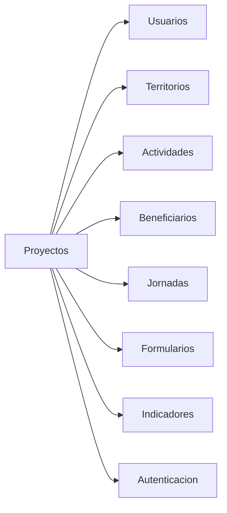

# Ruralia Backend — Documentación de sesión 03

> **Fecha:** 25 de junio de 2026  
> **Sesión:** CRUD completo del módulo `proyectos` (patrón base para otros módulos)  
> **Gestor de paquetes:** pnpm

---

## Resumen

Se implementó el CRUD completo de proyectos como **patrón reutilizable** para el resto de módulos del dominio.

Incluye:
- Service con lógica de negocio y permisos
- Controller con rutas REST y `@Roles`
- DTOs con `class-validator`
- Serialización con `ClassSerializerInterceptor` global y `RespuestaProyectoDto`
- Manejo de errores (`NotFoundException`, `ForbiddenException`, `ConflictException`)

---

## Dependencias instaladas

```bash
pnpm add class-validator class-transformer @nestjs/mapped-types
```

---

## Cambios en la entidad `Proyecto`

Se agregaron relaciones necesarias para el CRUD:

| Campo / relación | Tipo | Tabla intermedia |
|------------------|------|------------------|
| `creador` | ManyToOne → Usuario | `creador_id` |
| `veredas` | ManyToMany → Vereda | `proyecto_veredas` |
| `personal` | ManyToMany → Usuario | `proyecto_personal` |

Restricción única: `@Unique(['nombre', 'tipo'])` — evita duplicados del mismo nombre dentro del mismo tipo.

---

## Estructura del módulo

```
src/proyectos/
├── dto/
│   ├── crear-proyecto.dto.ts
│   ├── actualizar-proyecto.dto.ts
│   ├── asignar-territorios.dto.ts
│   ├── asignar-personal.dto.ts
│   ├── filtros-proyecto.dto.ts
│   ├── respuesta-proyecto.dto.ts
│   ├── respuesta-usuario-resumen.dto.ts
│   └── respuesta-vereda-resumen.dto.ts
├── entities/proyecto.entity.ts
├── utils/serializar-proyecto.ts
├── proyectos.service.ts
├── proyectos.controller.ts
└── proyectos.module.ts
```

---

## Endpoints

| Método | Ruta | Roles | Descripción |
|--------|------|-------|-------------|
| POST | `/proyectos` | ADMINISTRADOR, COORDINADOR | Crear proyecto |
| GET | `/proyectos` | Todos | Listar con filtros y paginación |
| GET | `/proyectos/:id` | Todos | Detalle con actividades, veredas y conteo beneficiarios |
| PATCH | `/proyectos/:id` | ADMINISTRADOR, COORDINADOR* | Actualizar |
| DELETE | `/proyectos/:id` | ADMINISTRADOR | Suspender (estado → SUSPENDIDO) |
| POST | `/proyectos/:id/territorios` | ADMINISTRADOR, COORDINADOR* | Asignar veredas |
| POST | `/proyectos/:id/personal` | ADMINISTRADOR, COORDINADOR* | Asignar personal |
| GET | `/proyectos/:id/estadisticas` | Todos | Estadísticas del proyecto |

\* COORDINADOR solo si está en el `personal` asignado al proyecto.

---

## ProyectosService — métodos

| Método | Comportamiento |
|--------|----------------|
| `crear` | Valida nombre único por tipo, asigna `creador` y lo incluye en `personal` |
| `listar` | Filtros: `estado`, `tipo`, `busqueda`; paginación `pagina`/`limite` |
| `obtenerUno` | Carga actividades, veredas, creador; calcula `conteoBeneficiarios` |
| `actualizar` | Verifica permisos; valida unicidad si cambia nombre/tipo |
| `suspender` | Cambia `estado` a `SUSPENDIDO` (no borra físicamente) |
| `asignarTerritorios` | Reemplaza veredas vinculadas |
| `asignarPersonal` | Reemplaza usuarios del equipo |
| `obtenerEstadisticas` | Conteos + % avance de indicadores |

### Estadísticas

```json
{
  "conteoBeneficiarios": 120,
  "conteoJornadas": 45,
  "conteoFormulariosEnviados": 38,
  "porcentajeAvanceIndicadores": 67.5
}
```

`porcentajeAvanceIndicadores` = suma de registros / suma de metas de indicadores vinculados (máx. 100%).

---

## DTOs de entrada

### CrearProyectoDto
- `nombre` (requerido)
- `descripcion`, `tipo`, `fechaInicio`, `fechaFin`

### ActualizarProyectoDto
- `PartialType(CrearProyectoDto)` — todos opcionales

### FiltrosProyectoDto
- `estado?`, `tipo?`, `busqueda?`, `pagina?` (default 1), `limite?` (default 10, máx. 100)

### AsignarTerritoriosDto / AsignarPersonalDto
- `veredaIds: string[]` / `usuarioIds: string[]` (UUID v4)

---

## Serialización

`main.ts` configura globalmente:

```ts
app.useGlobalPipes(new ValidationPipe({ whitelist: true, transform: true }));
app.useGlobalInterceptors(new ClassSerializerInterceptor(app.get(Reflector)));
```

`RespuestaProyectoDto` usa `@Expose()` para controlar qué campos salen en la respuesta. Campos internos de entidades (p. ej. `firebaseUid` en usuarios anidados) quedan excluidos vía `RespuestaUsuarioResumenDto`.

---

## Manejo de errores

| Situación | Excepción |
|-----------|-----------|
| Proyecto / vereda / usuario no existe | `NotFoundException` |
| Nombre duplicado en mismo tipo | `ConflictException` |
| COORDINADOR no asignado al proyecto | `ForbiddenException` |

---

## Permisos en capa de servicio

```ts
// ADMINISTRADOR → siempre puede gestionar
// COORDINADOR → solo si está en proyecto.personal
verificarPermisoGestion(proyecto, usuarioActual)
```

El `@Roles` del controller es la primera barrera; el servicio valida la asignación concreta para coordinadores.

---

## Patrón para otros módulos

Al replicar en otros módulos, seguir esta estructura:

1. **DTOs** — crear, actualizar (PartialType), filtros, asignación
2. **RespuestaXxxDto** — `@Expose()` + helper `aRespuestaXxx()` con `plainToInstance`
3. **Service** — lógica + excepciones HTTP semánticas
4. **Controller** — rutas REST + `@Roles` + `@UsuarioActual()`
5. **Module** — `TypeOrmModule.forFeature([...])` + exportar service si otros módulos lo necesitan

---

## Conexiones con otros módulos



| Módulo | Uso en proyectos |
|--------|------------------|
| `usuarios` | creador, personal asignado |
| `territorios` | veredas asignadas |
| `actividades` | relación en detalle |
| `beneficiarios` | conteo en detalle y estadísticas |
| `jornadas` | estadísticas |
| `formularios` | envíos vía jornadas en estadísticas |
| `indicadores` | % avance en estadísticas |
| `autenticacion` | guards + `@Roles` + `@UsuarioActual()` |

---

## Historial de sesiones

| Sesión | Fecha | Contenido |
|--------|-------|-----------|
| 01 | 2026-06-25 | Estructura base de dominio |
| 02 | 2026-06-25 | Autenticación Firebase Admin SDK |
| 03 | 2026-06-25 | CRUD proyectos (patrón base) |
