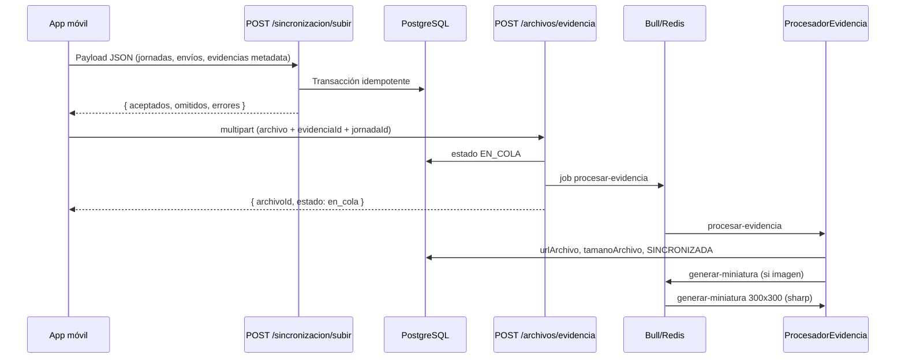

# Ruralia Backend — Documentación de sesión 04

> **Fecha:** 25 de junio de 2026  
> **Sesión:** Sincronización offline y procesamiento asíncrono de archivos  
> **Gestor de paquetes:** pnpm

---

## Resumen

Se implementó la infraestructura para que la app móvil sincronice datos offline y suba archivos de evidencia de forma asíncrona:

1. **SincronizacionModule** — recibe payload JSON al recuperar conexión
2. **ArchivosModule** — subida multipart de evidencias
3. **ColaModule** — Bull + Redis con degradación graceful
4. **Throttling** — global por IP y específico por usuario en sync

---

## Dependencias instaladas

```bash
pnpm add @nestjs/bull bull @nestjs/throttler sharp ioredis
pnpm add -D @types/multer
```

---

## Variables de entorno nuevas

| Variable | Default | Descripción |
|----------|---------|-------------|
| `REDIS_HOST` | localhost | Host Redis para Bull |
| `REDIS_PORT` | 6379 | Puerto Redis |
| `RUTA_SUBIDAS` | ./subidas | Directorio base de archivos |
| `TAMANO_MAXIMO_ARCHIVO` | 52428800 (50MB) | Límite Multer |

---

## Cambios en entidades

Se agregaron campos para idempotencia offline:

| Entidad | Campos nuevos |
|---------|---------------|
| `Jornada` | `idLocal`, `dispositivoId`, `esOffline`, `sincronizadoEn` |
| `EnvioFormulario` | `idLocal`, `dispositivoId` |
| `Evidencia` | `idLocal`, `dispositivoId`, `estado`, `urlMiniatura` |

Restricción única `(dispositivoId, idLocal)` en cada tabla.

**Enum `EstadoEvidencia`:** `PENDIENTE_ARCHIVO` → `EN_COLA` → `SINCRONIZADA`

---

## Flujo de sincronización



---

## SincronizacionModule

### Endpoint

```
POST /sincronizacion/subir
Auth: requerida
Throttle: 10 req/min por usuario
```

### Payload (`SubirSincronizacionDto`)

```json
{
  "dispositivoId": "device-abc",
  "sincronizadoEn": "2026-06-25T10:00:00.000Z",
  "jornadas": [...],
  "enviosFormulario": [...],
  "evidencias": [...]
}
```

### Procesamiento (`SincronizacionService`)

1. Valida con `class-validator`
2. Transacción TypeORM en orden: **Jornadas → Envíos/Respuestas → Evidencias (metadata)**
3. Marca `esOffline: true` y `sincronizadoEn` con timestamp actual
4. Idempotencia: si existe `dispositivoId + idLocal` → omite (cuenta en `omitidos`)
5. Retorna `{ aceptados, omitidos, errores[] }`

---

## ArchivosModule

### Endpoint

```
POST /archivos/evidencia
Content-Type: multipart/form-data
Campos: archivo (file), evidenciaId (UUID), jornadaId (UUID)
```

### Restricciones Multer

- Tamaño máximo: `TAMANO_MAXIMO_ARCHIVO` (default 50MB)
- Tipos: `image/*`, `application/pdf`, `video/mp4`

### Almacenamiento

```
{RUTA_SUBIDAS}/{proyectoId}/{jornadaId}/{uuid}.{ext}
```

### Respuesta inmediata

```json
{ "archivoId": "uuid-evidencia", "estado": "en_cola" }
```

---

## ColaModule (Bull)

### Cola: `cola-evidencias`

| Job | Acción |
|-----|--------|
| `procesar-evidencia` | Actualiza `urlArchivo`, `tamanoArchivo`, estado `SINCRONIZADA` |
| `generar-miniatura` | Imagen 300x300 con `sharp` (omite con warning si falla) |

**Reintentos:** `attempts: 3`, `backoff: 5000ms` fijo

### Redis opcional

Al arrancar, `ColaModule.forRoot()` hace ping a Redis:

- **Disponible:** registra Bull + `ProcesadorEvidencia`
- **No disponible:** warning en log, procesamiento **síncrono** vía `ColaEvidenciasService`

La app **no crashea** sin Redis.

```typescript
// main.ts
const colaModule = await ColaModule.forRoot();
const app = await NestFactory.create(AppModule.register(colaModule));
```

---

## Throttling

| Alcance | Límite | Tracker |
|---------|--------|---------|
| Global (APP_GUARD) | 100 req/min | IP |
| `POST /sincronizacion/subir` | 10 req/min | `usuario.id` (`ThrottlerPorUsuarioGuard`) |

---

## Estructura de archivos

```
src/
├── cola/
│   ├── cola.module.ts
│   ├── cola-evidencias.service.ts
│   └── utils/probar-redis.ts
├── sincronizacion/
│   ├── dto/
│   ├── sincronizacion.controller.ts
│   └── sincronizacion.service.ts
├── archivos/
│   ├── archivos.controller.ts
│   ├── archivos.service.ts
│   ├── evidencia-procesamiento.service.ts
│   └── procesador-evidencia.processor.ts
└── common/guards/throttler-por-usuario.guard.ts
```

---

## Historial de sesiones

| Sesión | Fecha | Contenido |
|--------|-------|-----------|
| 01 | 2026-06-25 | Estructura base de dominio |
| 02 | 2026-06-25 | Autenticación Firebase |
| 03 | 2026-06-25 | CRUD proyectos |
| 04 | 2026-06-25 | Sync offline + archivos + Bull |
