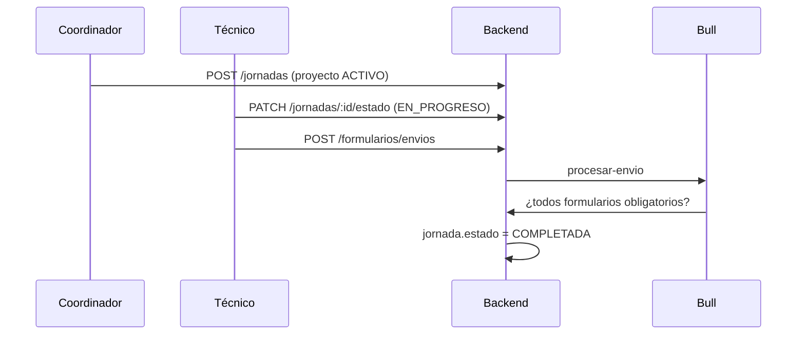

# Ruralia Backend — Documentación de sesión 05

> **Fecha:** 25 de junio de 2026  
> **Sesión:** Módulos operativos `jornadas` y `formularios`

---

## Resumen

Se implementó el núcleo operativo del sistema: gestión de jornadas de campo y formularios dinámicos con procesamiento asíncrono post-envío.

---

## JornadasModule

### JornadasService

| Método | Descripción |
|--------|-------------|
| `crear` | Valida proyecto `ACTIVO`, asigna técnico responsable |
| `listar` | Filtros: proyectoId, actividadId, usuarioId, fechas, estado + paginación |
| `obtenerUna` | Relaciones completas + envíos y evidencias |
| `actualizar` | Actualización parcial de datos de jornada |
| `cambiarEstado` | Flujo `PLANIFICADA → EN_PROGRESO → COMPLETADA` |
| `agregarBeneficiarios` | Agrega sin duplicar |
| `agregarMiembroEquipo` | Agrega usuario al equipo |
| `obtenerResumen` | Conteos: formularios, evidencias, firmas, beneficiarios |

### Permisos `cambiarEstado`

- Técnico responsable o miembro del equipo
- O `COORDINADOR` / `ADMINISTRADOR`

### Rutas (`/jornadas`)

| Método | Ruta | Auth |
|--------|------|------|
| POST | `/` | Sí |
| GET | `/` | Sí |
| GET | `/:id` | Sí |
| GET | `/:id/resumen` | Sí |
| PATCH | `/:id` | Sí |
| PATCH | `/:id/estado` | Sí |
| POST | `/:id/beneficiarios` | Sí |
| POST | `/:id/equipo` | Sí |

---

## FormulariosModule

Importa `JornadasModule` para acceder a `JornadasService`.

### PlantillasFormularioService

| Método | Descripción |
|--------|-------------|
| `crear` | Plantilla + campos en transacción (`estaActivo: false`) |
| `listarPorSubactividad` | Plantillas con campos |
| `publicar` | `estaActivo: true` si tiene ≥1 campo |
| `clonar` | Duplica plantilla y campos con nuevos IDs |

### EnviosFormularioService

| Método | Descripción |
|--------|-------------|
| `enviar` | Valida obligatorios, guarda envío + respuestas, encola `procesar-envio` |
| `listarPorJornada` | Envíos de una jornada |
| `obtenerRespuestas` | Respuestas con etiqueta del campo |

### DTOs críticos

**CrearPlantillaFormularioDto** — incluye `campos: CrearCampoFormularioDto[]`

**EnviarFormularioDto** — incluye `respuestas: { claveCampo, valor }[]`

### Rutas (`/formularios`)

| Método | Ruta |
|--------|------|
| POST | `/plantillas` |
| GET | `/plantillas/subactividad/:subactividadId` |
| POST | `/plantillas/:id/publicar` |
| POST | `/plantillas/:id/clonar` |
| POST | `/envios` |
| GET | `/envios/jornada/:jornadaId` |
| GET | `/envios/:id/respuestas` |

---

## ProcesadorEnvios (Bull)

Cola: `cola-envios` — job `procesar-envio`

**Lógica (`EnvioProcesamientoService`):**
1. Obtiene plantillas activas de la subactividad de la jornada
2. Verifica que cada plantilla tenga un envío con campos obligatorios completos
3. Si todo está completo y jornada está `EN_PROGRESO` → cambia a `COMPLETADA`

Sin Redis: procesamiento síncrono (mismo patrón que evidencias).

---

## Flujo operativo completo

---

## Historial de sesiones

| Sesión | Contenido |
|--------|-----------|
| 01 | Estructura base de dominio |
| 02 | Autenticación Firebase |
| 03 | CRUD proyectos |
| 04 | Sync offline + archivos |
| 05 | Jornadas + formularios operativos |
